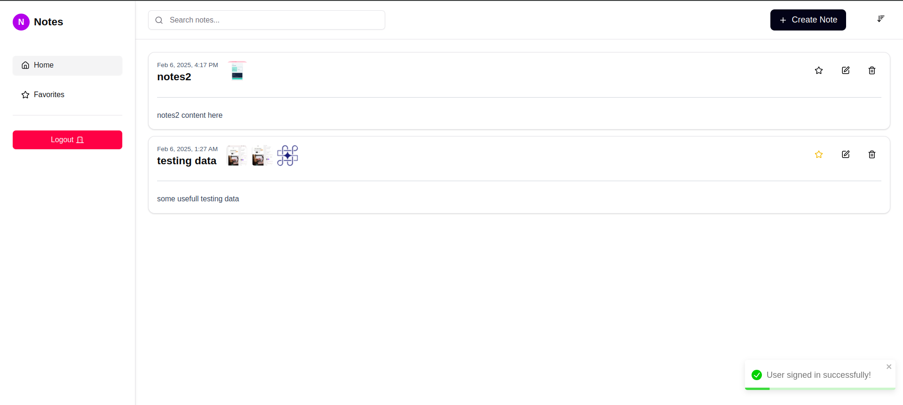

# NoteTaking Application

A full-stack note-taking web application with voice-to-text transcription, image uploads, and real-time updates.



## Features

- **Create/Edit Notes**: Rich text notes with titles and content
- **Voice-to-Text**: Speech recognition for hands-free note creation
- **Image Support**: Upload up to 3 images per note
- **Filtering & Sorting**:
  - Search notes by title/content
  - Filter by favorites
  - Sort by newest/oldest
- **Authentication**: JWT-based user authentication
- **Responsive UI**: Mobile-friendly interface
- **Real-time Updates**: Instant state management
- **Loading States**: Visual feedback for async operations
- **Error Handling**: Toast notifications for errors

## Technologies Used

- **Frontend**:

  - Next.js 14 (App Router)
  - TypeScript
  - Tailwind CSS
  - React Hook Form
  - Axios
  - React Toastify
  - Web Speech API

- **Backend**:

  - Next.js (Api folder)
  - MongoDB/Mongoose
  - JWT Authentication
  - Cloudinary (Image uploads)

## Installation

1. Clone the repository:

```bash
git clone https://github.com/AnchalDevBytes/voice-todo-assignment.git
cd voice-todo-assignment
```

2. **Install dependencies:**

   ```bash
   npm install
   ```

3. **Configure Environment Variables**

   ```bash
    MONGODB_URI=your_mongodb_connection_string
    JWT_SECRET=your_jwt_secret_key
    CLOUDINARY_CLOUD_NAME=your_cloudinary_name
    CLOUDINARY_API_KEY=your_cloudinary_key
    CLOUDINARY_API_SECRET=your_cloudinary_secret
   ```

4. **Run the development server:**

   ```bash
   npm run dev
   ```

   The app will be available at http://localhost:3000.

5. **Deployment:**
   Deployed on vercel : [live](https://voice-todo-assignment.vercel.app/)
